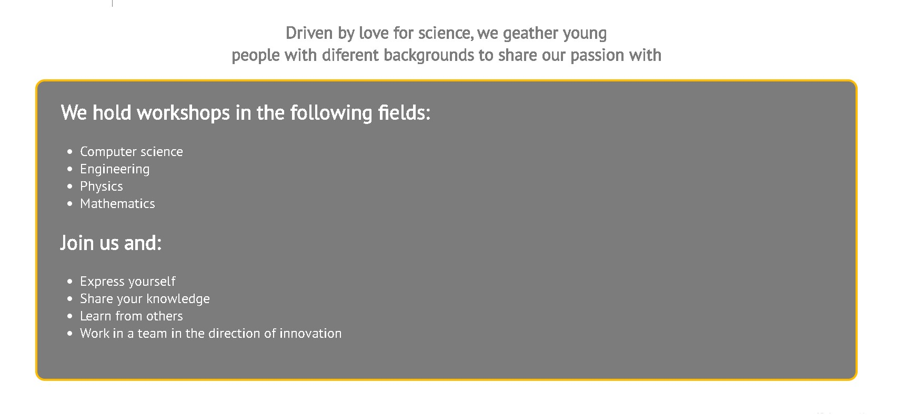

# SCIENCE CLUB 51

## Author
Nemanja Bajakic 

## Project Overview
- SCIENCE CLUB 51 is an association that gathers young people who have a passion for science.
- It got it's name from the former postal code of the place where it is located - Reinickendorf.
- Workshops in the fields of computer science, engineering, physics and mathematics are held according to the schedule for everyone who wants to expand their knowledge, as well as work on exciting projects.
- This site enables users to get information about the club itself and details related to it.

You can view the deployed website [here](https://nezzo23.github.io/science-club/)

Here is a github repository [link](https://github.com/Nezzo23/science-club)

## FEATURES

### Navigation Bar
- Navigation bar is contains home, about and sing in buttons.
- It is fixed on the top of the page so it makes it easy to navigate the site at any time.
- ach of the navigation items will light up when the user hovers over it with the yellow color characteristic of this site

img

### Hero Image
- Home page has a hero image light bulb that represents the creation of an idea, in accordance with the nature of the site

img

### Home Page 
- The entire site is designed as one page divided into sections: landing, about, schedule, signup.

img

### Quote
- Below the logo image is a quote that should inspire users to join the association.

img

### Workshop icons
- 4 types of association workshops are presented through icons characteristic of computer science, engineering, physics and mathematics.
- In the future, as the site develops, each of them will be an active link leading to the following pages of the site.

img

### About
- This part of the page talks about the point of the club itself. 
- The areas from which the club holds workshops are presented, as well as the reasons for joining it.

img

### Schedule, location and contact
- Dates during which the workshops are held.
- Address (hidden meaning) and contact email.

### Sign up
- Section where users can join the club.
- The join button lights up in a characteristic yellow color when you hover over it.

img

### Social media and logo icon
- Each of the three buttons are active and lead to different social networks.
- They were designed deliberately simply without icons because they would divert attention from the icons that are important for the nature of the site.
- When the user hovers over them, they light up yellow.
- The logo icon is also active and leads to the top of the page.

img

## TESTING

### Validation Testing
- HTML
   - No errors were returned through the official [HTML validator](https://validator.w3.org/nu/?doc=https%3A%2F%2Fcaramcavinchey.github.io%2Fthe-puzzle-exchange%2F)
 

- CSS
   - No errors were found through the [CSS validator](https://jigsaw.w3.org/css-validator/validator?uri=https%3A%2F%2Fcaramcavinchey.github.io%2Fthe-puzzle-exchange%2F&profile=css3svg&usermedium=all&warning=1&vextwarning=&lang=en).

### Compatibility and Responsive Testing
- I ensured my site was worked well, and looked nice on a variety of devices & browsers as noted in the table below:
- For the devices under 350px width it is recomended to use landscape mode.

| **TOOL / Device**           | **BROWSER**      | **OS**  | **SCREEN WIDTH** |
|-----------------------------|------------------|---------|------------------|
| dev tools: Galaxy Fold      | Chrome           | android | 280 x 653 px     |
| dev tools: iPhone SE        | safari           | iOs     | 375 x 667 px     |
| dev tools: Pixel 2          | Chrome           | android | 411 x 731        |
| real phone: iPhone XR       | safari           | iOs     | 414 x 896 px     |
| browserstack: Nexus 7       | Firefox          | android | 960 x 600 px     |
| browserstack: iPhone 13 Pro | safari           | iOs     | 390px × 844px    |
| real tablet: iPad Pro 11    | Chrome           | iOs     | 834 x 1075 px    |
| real laptop: Macbook Pro    | Firefox & Chrome | iOs     | 1400 x 766 px    |
| broswerstack                | Firefox          | iOs     | 1440 x 672 px    |
| browserstack                | Edge 99          | windows | 1440 x 672 px    |

### Testing User Stories from User Experience (UX) Section

**First time visitor:**
1. I want to learn more about the Puzzle Exchange and what the group is all about.
   1. The user is greeted with a bold logo and clear navigation bar to go to the page of their choice.
   2. Below the menu is a hero image of a puzzle piece wih cover text welcoming and introducing the main point of the website. 

2. I want to investigate the meet up locations, times and how to sign up as a member.
   1. The clear navigation bar allows users to visit each page smoothly and click to navigate between pages.
   2. The locations page includes a short description and embedded map of each meet up location for future convenience.
   3. The sign up form button will show a successful submission page by opening in a new tab for the user.
 
3. I want to find the social media links to see their following and to look at photos from past meet ups.
   1. The footer on each page includes contact information and links to the social media pages of the group.
   2. The links will open in a new browser tab, users won't need to use the back arrow to return to the website. 

**Returning visitor:**
1. I want to find out where the next meet up location will be for the month.
      1. Returning users will be familiar with the navigation menu and can click through easily to the locations page.
      2. The embedded maps will allow users to open the map on their device for directions.
2. I want to contact the organisers about the exchange process.
      1. The footer contains social links for Facebook, Instagram and Twitter which open on a new tab when clicked.
      2. The email address for general queries is included in the footer in each page.
3. I want to sign up as a new member after considering my decision.
      1. The sign up form has a required function for each input, ensuring users don't forget any information.
      2. After submission of the form, a new tab will open to acknowledge successful completion.

**Frequent user:**
 1. I want to check to see if there are any new meet up locations for the month.
      1. Frequent visitors can easily click through to the locations page to view updates of dates and locations three months ahead.
 2. I want to contact the organisers about borrowing, returning or add a new puzzle to the exchange or general queries. 
      1. The user can easily scroll to the bottom of the page and find the contact information for queries or link to social media.

### Manual Testing
- You can view manual testing of the website [here](https://docs.google.com/spreadsheets/d/16XqjGOfWqQrNFe5B4ZjzjadKg1do8L6vFcukGPGYe8c/edit?usp=sharing)

### Outstanding Defects
- No outstanding defects, all issues logged on GitHub and solved.

### Defects of Note
1. The website was designed mobile-first which caused some challenges when resizing the fonts and navigation for larger screen sizes. Flexbox solved this and using % for font-size in the media queries.
2. The display of the site on an ultra-wide screen didn't look appealing, a wrapping container solved the issue with a max-width with the help of my mentor.  

## ACCESSIBILITY

### Lighthouse Audit
- The deployed website was run through [web.dev measure](https://web.dev/measure/) to check performance, accessibility, best practices and SEO scores. 

### Keyboard Navigation
- The user will be able to use the tab, arrow and enter keys if needed when navigating the website.

## DEPLOYMENT
1. Click on the settings link in the menu:

2. In the left hand menu, click on the pages link:

3. In the sources section of the GitHub pages, click on the dropdown menu to select main as the source:

4. After you've selected main, hit the save button:

5. Eventually you'll see a blue area with the deployment URL and a success message:

## CREDITS
- All content was written by the developer.
- Code Institute Student Template: [gitpod full template](https://github.com/Code-Institute-Org/gitpod-full-template).

### Media
- The pairing of Roboto Condensed and Lato were chosen using [FontJoy](https://fontjoy.com/#) and [Google Fonts](https://fonts.google.com/share?selection.family=Lato|Roboto+Condensed:wght@700). 
- The colors for the website was generated using [Image Color Picker](https://imagecolorpicker.com/).
- All images were sourced using [Pexels](https://www.pexels.com).
- The icons for the favicon, footer, about page and location headings were taken from [Font Awesome](https://fontawesome.com/).
- The google maps code was generated using [Google Maps Generator](https://google-map-generator.com/).
- The ordered list was styled with the help and instructions of [CSS Tricks](https://css-tricks.com/list-style-recipes/).

## ACKNOWLEDGEMENTS
- Thank you to my mentor for continuous helpful feedback and support throughout the project.
- The tutors at Code Institute for their patience and support.
- The Code Institute Slack community for tips and guidance.
- Flexbox tutorial and instructions from [Kevin Powell](https://www.youtube.com/watch?v=u044iM9xsWU) and flexbox article from [Tania Rascia](https://www.taniarascia.com/easiest-flex-grid-ever/).
- Extra coding support for the sign up form via [W3schools](https://www.w3schools.com/) and [css-tricks.com](https://css-tricks.com/)

[Back to the beginning](#table-of-contents)