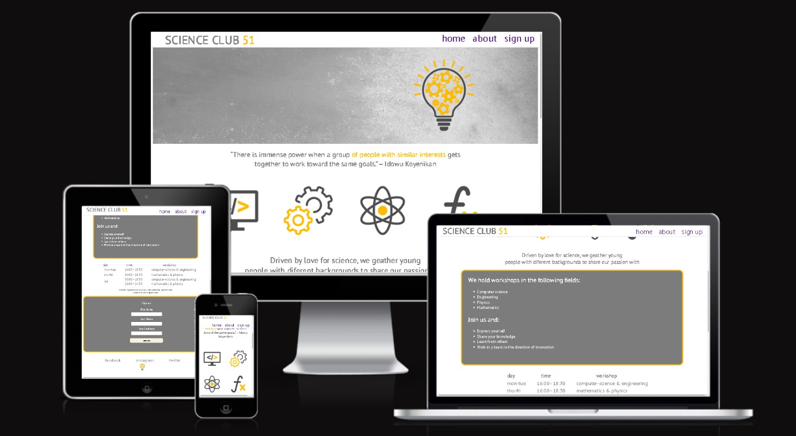

# SCIENCE CLUB 51

## Author
Nemanja Bajakic 

## Project Overview
- SCIENCE CLUB 51 is an association that gathers young people who have a passion for science.
- It got it's name from the former postal code of the place where it is located - Reinickendorf.
- Workshops in the fields of computer science, engineering, physics and mathematics are held according to the schedule for everyone who wants to expand their knowledge, as well as work on exciting projects.
- This site enables users to get information about the club itself and details related to it.

You can view the deployed website [here](https://nezzo23.github.io/science-club/)

Here is a github repository [link](https://github.com/Nezzo23/science-club)

## FEATURES

